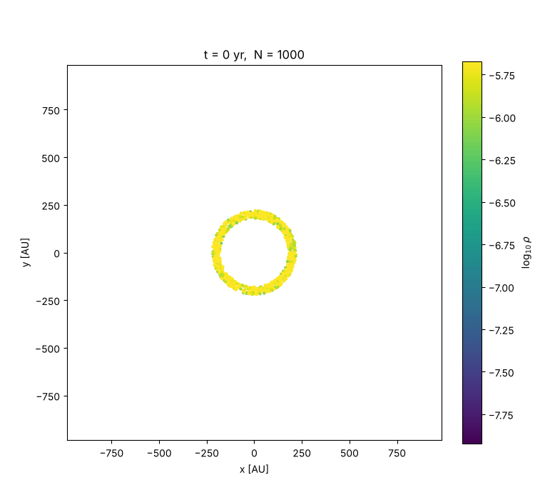
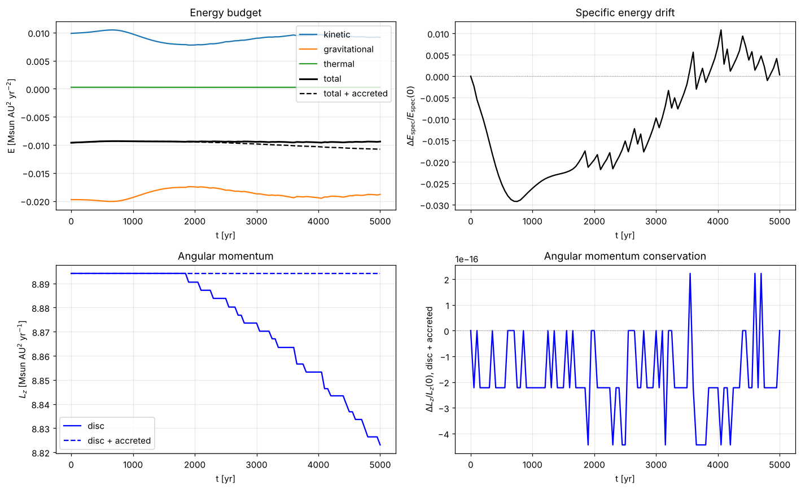
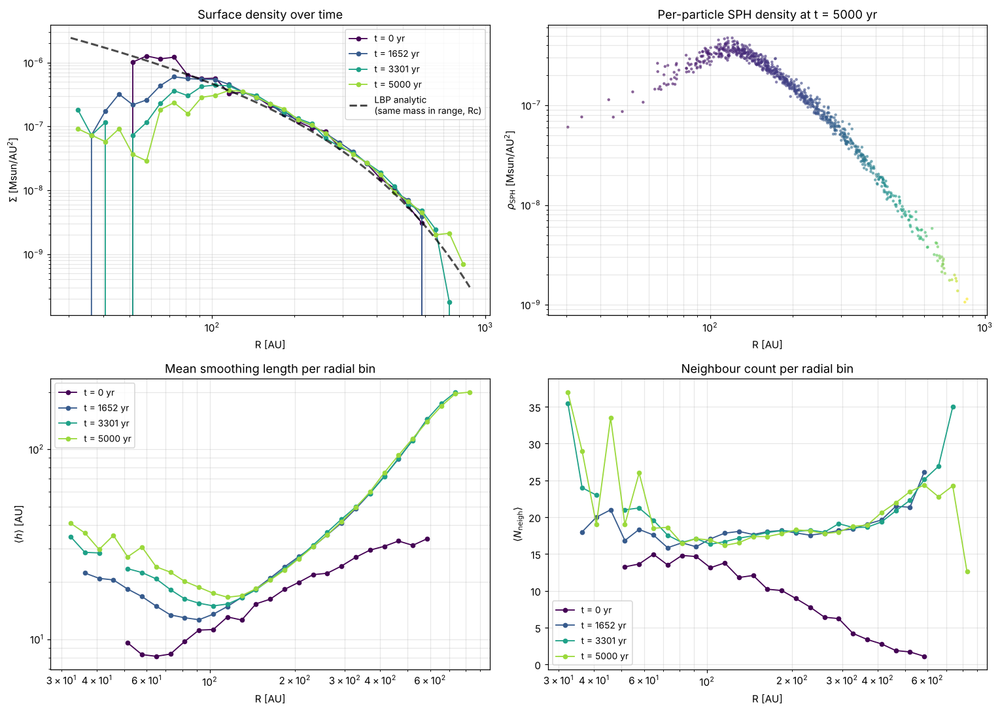

# 2-D SPH simulation of a protoplanetary disc

A smoothed-particle hydrodynamics solver for a thin accretion disc, written from
scratch in Python: kernel, density estimator, forces, artificial viscosity and
time integrator are all implemented here, with no SPH library underneath.

Built as the computational project for the *Problem Solving* course at IUSS
Pavia, alongside a master's thesis on protoplanetary disc kinematics.



*A ring of 1000 particles at 200 AU spreading under pressure and viscosity over
5000 years, coloured by log density. Particles inside 30 AU are accreted by the sink.*

## The physical system

A razor-thin, locally isothermal disc orbiting a 1 M<sub>☉</sub> star. The gas
feels its own pressure gradient and the star's gravity; the star is treated as an
external point mass rather than as a particle. Temperature follows a power law,
T(R) = T₁₀₀ (R / 100 AU)<sup>−q</sup> with q = 0.23, so the equation of state is
P = ρ c<sub>s</sub>(R)².

Two initial conditions are available:

| `PROFILE` | Surface density | Purpose |
|---|---|---|
| `"lbp"` | Lynden-Bell & Pringle self-similar disc | Compare against the analytic viscous-spreading solution |
| `"ring"` | Thin ring at R = 200 AU | Watch viscous spreading develop from a localised feature |

The LBP profile is initialised with the pressure-corrected rotation curve, so the
disc starts close to radial equilibrium rather than relaxing into it.

## The method

| Component | Choice |
|---|---|
| Kernel | M4 cubic spline, σ<sub>2D</sub> = 10 / 7π |
| Smoothing length | Adaptive, h = η (m/ρ)<sup>1/d</sup> with η = 1.2, solved jointly with the density sum by damped fixed-point iteration |
| Neighbour search | `scipy.spatial.cKDTree`, flat pair list symmetrised so Newton's third law holds exactly |
| Pressure force | Symmetric form, P<sub>i</sub>/ρ<sub>i</sub>² + P<sub>j</sub>/ρ<sub>j</sub>² |
| Artificial viscosity | Monaghan, α = 1, β = 2, applied only on approach (**v**<sub>ij</sub>·**r**<sub>ij</sub> < 0) |
| Integrator | Leapfrog kick-drift-kick |
| Timestep | Minimum of the CFL, acceleration and viscous-signal criteria |
| Inner boundary | Accreting sink at R = 30 AU |

The inner loops are JIT-compiled with `numba`. If `numba` is not installed the
same code runs interpreted, which is considerably slower but produces identical
results.

## Validation

All numbers below come from the default configuration (N = 1000, 5000 years)
and are printed at the end of every run. A run takes about 50 s on a laptop
with `numba`.

| Check | Ring | Self-similar (LBP) |
|---|---|---|
| Angular momentum, disc + accreted, relative change | ~10⁻¹⁶ (round-off) | ~10⁻¹⁶ (round-off) |
| Mass accreted by the sink | 2.1% | 18.8% |
| Total energy, disc + accreted | −12% | −35% |

**Angular momentum.** Every force in the code is central and pairwise
antisymmetric, so L<sub>z</sub> can only leave the disc through the sink. The code
records what each accreted particle carries away; the sum of disc and accreted
material is then conserved to machine precision, while the disc alone loses
exactly what the sink takes. The unit tests check the antisymmetry directly:
the SPH forces on a random particle set exert no net force and no net torque.



**Energy.** Energy is not conserved, and should not be: the gas is locally
isothermal, so the heat produced by viscosity and compression is radiated
immediately. Adding back the accreted material, the total decreases by the
energy the gas loses while it moves inwards, the accretion luminosity of a real
disc. Smaller contributions come from the adaptive smoothing length without
grad-h terms and from the adaptive timestep, which breaks the symplectic
property of leapfrog.

**Surface density.** For the LBP initial conditions, Σ(R) is compared against
the analytic profile, normalised to carry the same mass over the plotted range.
Between 100 and 500 AU the disc keeps its self-similar shape; the two edges move
for the reasons listed under *Known limitations*.



## Running it

```bash
pip install -r requirements.txt
python make_ic.py ring   # or: lbp. Samples the particles -> disc_ic.npz
python run_sph.py        # integrates and writes the figures
pytest tests             # kernel and force-symmetry checks
```

Parameters live in a configuration block at the top of each file. `make_ic.py`
controls the particle number and disc mass; `run_sph.py` controls the
viscosity coefficients, timestep safety factors, sink radius and integration
time.

Outputs:

| File | Contents |
|---|---|
| `disc_ic_diagnostics.png` | Initial conditions: face-on view, sampled vs analytic Σ(R), rotation curve |
| `sph_density_diagnostics.png` | Σ(R) over time, per-particle density, smoothing length and neighbour count per radial bin |
| `sph_energy_angmom.png` | Energy budget and angular momentum, totals and specific values |
| `sph_disc_evolution.gif` | Animation coloured by log ρ |

## Known limitations

- Edges: a particle at the edge of the disc has neighbours on one side only, so
  its density is underestimated and the unbalanced pressure pushes the edges
  outwards (and the inner one into the sink).
- Resolution: with 1000 particles the smoothing length is comparable to the
  scale height, so the effective viscosity corresponds to α ≈ 0.1–0.2, well
  above real discs, and the disc evolves faster than it would.
- No self-gravity: the disc mass enters the initial conditions but not the force
  calculation.
- No grad-h correction terms, which is the main source of the energy drift.
- 2-D only. `DIM` is carried through the kernel and density estimator, but the
  initial conditions and the diagnostics are written for the planar case.

## References

- Monaghan (1992), *Smoothed particle hydrodynamics*, ARA&A 30, 543
- Price (2012), *Smoothed particle hydrodynamics and magnetohydrodynamics*, JCP 231, 759
- Lynden-Bell & Pringle (1974), MNRAS 168, 603

## Licence

MIT.
